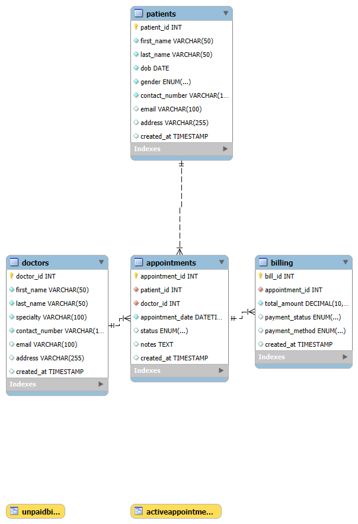

# week8_database_final_submission
# Clinic Booking System 🏥

A comprehensive MySQL-based database management system for handling patient records, doctor information, and appointment bookings efficiently.

---

## 📌 **Project Description**
The **Clinic Booking System** is designed to manage the operations of a clinic, including:
- Patient registration and record management.
- Doctor information and specialization tracking.
- Scheduling and management of patient appointments.
- Secure and optimized data retrieval.

---

## 🗃️ **Database Schema**
The system is designed with a normalized database structure with the following main tables:
1. **patients** - Stores patient information.
2. **doctors** - Stores doctor details.
3. **appointments** - Manages bookings and schedules.
4. **medical_records** - Keeps a record of patient visits and diagnoses.

---

## 🚀 **Setup Instructions**
To get started with the database:
1. Open MySQL Workbench or Command Line.
2. Run the following command to create the database:
   ```sql
   CREATE DATABASE clinic_booking_system;
   ## 🔎 **Entity-Relationship Diagram (ERD)**


